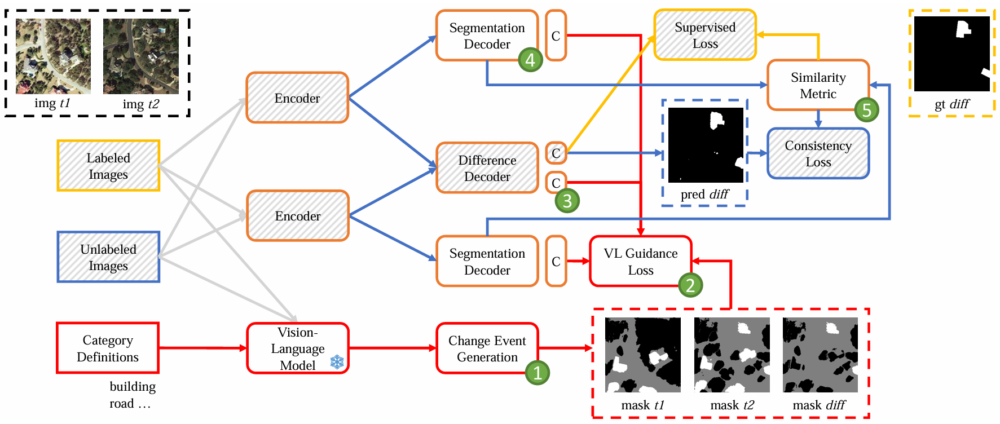

# SemiCD-VL: Visual-Language Model Guidance Makes Better Semi-supervised Change Detector

**Code for SemiCD-VL (formerly: DiffMatch) paper: [SemiCD-VL: Visual-Language Model Guidance Makes Better Semi-supervised Change Detector.](https://arxiv.org/abs/2405.04788)**

## Overview

Change Detection (CD) aims to identify pixels with semantic changes between images. However, annotating massive numbers of pixel-level images is labor-intensive and costly, especially for multi-temporal images, which require pixel-wise comparisons by human experts. Considering the excellent performance of visual language models (VLMs) for zero-shot, open-vocabulary, etc. with prompt-based reasoning, it is promising to utilize VLMs to make better CD under limited labeled data. In this paper, we propose a VLM guidance-based semi-supervised CD method, namely SemiCD-VL. The insight of SemiCD-VL is to synthesize free change labels using VLMs to provide additional supervision signals for unlabeled data. However, almost all current VLMs are designed for single-temporal images and cannot be directly applied to bi- or multi-temporal images. Motivated by this, we first propose a VLM-based mixed change event generation (CEG) strategy to yield pseudo labels for unlabeled CD data. Since the additional supervised signals provided by these VLM-driven pseudo labels may conflict with the original pseudo labels from the consistency regularization paradigm (e.g. FixMatch), we propose the dual projection head for de-entangling different signal sources. Further, we explicitly decouple the bi-temporal images semantic representation through two auxiliary segmentation decoders, which are also guided by VLM. Finally, to make the model more adequately capture change representations, we introduce contrastive consistency regularization by constructing feature-level contrastive loss in auxiliary branches. Extensive experiments show the advantage of SemiCD-VL. For instance, SemiCD-VL improves the FixMatch baseline by +5.3 $IoU^c$ on WHU-CD and by +2.4 $IoU^c$ on LEVIR-CD with 5\% labels, and SemiCD-VL requires only 5\% to 10\% of the labels to achieve performance similar to the supervised methods. In addition, our CEG strategy, in an un-supervised manner, can achieve performance far superior to state-of-the-art (SOTA) un-supervised CD methods (e.g., IoU improved from 18.8\% to 46.3\% on LEVIR-CD dataset).

<div align="center">



</div>

We evaluate SemiCD-VL on 2 change detection datasets (LEVIR-CD and WHU-CD), where it achieves major gains over previous semi-supervised methods as shown below.


If you find SemiCD-VL useful in your research, please consider citing:

```
@article{li2024semicd_vl,
  title={SemiCD-VL: Visual-Language Model Guidance Makes Better Semi-supervised Change Detector},
  author={Li, Kaiyu and Cao, Xiangyong and Deng, Yupeng and Liu, Junmin and Meng, Deyu and Wang, Zhi},
  journal={arXiv preprint arXiv:2405.04788},
  year={2024}
}
```

## Getting Started

### Environment

Create a conda environment:

```bash
conda create -n semicd_vl python=3.7.13
conda activate semicd_vl
```

Install the required pip packages:

```bash
pip install -r requirements.txt
```

### Pre-Trained Backbones

[ResNet-50](https://drive.google.com/file/d/1mqUrqFvTQ0k5QEotk4oiOFyP6B9dVZXS/view?usp=sharing) | [ResNet-101](https://drive.google.com/file/d/1Rx0legsMolCWENpfvE2jUScT3ogalMO8/view?usp=sharing) | [Xception-65](https://drive.google.com/open?id=1_j_mE07tiV24xXOJw4XDze0-a0NAhNVi)

```
├── ./pretrained
    ├── resnet50.pth
    ├── resnet101.pth
    └── xception.pth
```

### Dataset

- WHU-CD: [imageA, imageB, and label](https://www.dropbox.com/s/r76a00jcxp5d3hl/WHU-CD-256.zip?dl=0)
- LEVIR-CD: [imageA, imageB, and label](https://www.dropbox.com/s/18fb5jo0npu5evm/LEVIR-CD256.zip?dl=0)

Please modify your dataset path in configuration files.

```
├── [Your WHU-CD/LEVIR-CD Path]
    ├── A
    ├── B
    └── label
```


## Off-line generate VLM-guidance pseudo label

<font color="red"><strong>We provide the generated pseudo labels in the `gen_cd_label` and `gen_seg_label` directories ([Download](https://pan.baidu.com/s/1XuNJ3BLZyp8JiHDFQM9b3A?pwd=w0a7)), and you can skip this step.</strong></font> If you want to reproduce our results step by step, you can refer to the following:

### APE

APE is a vision-language model which can conduct open-vocabulary detection and segmentation. We directly use the released checkpoint [APE-D](https://huggingface.co/shenyunhang/APE/blob/main/configs/LVISCOCOCOCOSTUFF_O365_OID_VGR_SA1B_REFCOCO_GQA_PhraseCut_Flickr30k/ape_deta/ape_deta_vitl_eva02_clip_vlf_lsj1024_cp_16x4_1080k_mdl_20230829_162438/model_final.pth) to infer the roughly defined categories `house, building, road, grass, tree, water`, using the following commands:

```bash
# As an example, generate pre-event pseudo labels for the WHU-CD dataset.
python demo/demo_lazy.py --config-file configs/LVISCOCOCOCOSTUFF_O365_OID_VGR_SA1B_REFCOCO_GQA_PhraseCut_Flickr30k/ape_deta/ape_deta_vitl_eva02_clip_vlf_lsj1024_cp_16x4_1080k.py --input data/WHU-CD-256/A/*.png --output APE_output/whu-cd_pseudo-label_ape_prob/A/ --confidence-threshold 0.2 --text-prompt 'house,building,road,grass,tree,water' --with-sseg --opts train.init_checkpoint=model_final.pth model.model_vision.select_box_nums_for_evaluation=500 model.model_vision.text_feature_bank_reset=True
```

Before executing the above commands, please make sure that you have successfully built the APE environment. Please refer [here](https://github.com/shenyunhang/APE) to build APE's reasoning environment, we highly recommend using **docker** to build it.

After reasoning with APE, use the following commands for execute Change Event Generation (CEG) strategy:

```bash
# Execute instance-level CEG strategy
python scripts/gen_cd_map_json.py
# Execute Mixed CEG strategy
python scripts/gen_cd_map.py
```

## Training

To launch a training job, please run:

```bash
python experiments.py --exp EXP_ID --run RUN_ID
# e.g. EXP_ID=47; RUN_ID=0 for SemiCD-VL on LEVIR-CD with 5% labels
```

It will automatically generate the relevant config files in `configs/generated/` and start the corresponding training job.

For more information on the available experiments and runs, please refer to `def generate_experiment_cfgs(exp_id)` in [experiments.py](experiments.py).

The training log, tensorboard, checkpoints, and debug images are stored in `exp/`.

## Framework Structure

The following list provides the most relevant files of SemiCD-VL(DiffMatch)'s implementation:

* [experiments.py](experiments.py): Definitions of the experiment configs used in the paper.
* [diffmatch_fixmatch.py](diffmatch_fixmatch.py): Main training logic for DiffMatch.
* [model/vlm.py](model/vlm.py): Vision-language model class.
* [model/builder.py](model/builder.py): Logic for building a model from a config including a forward wrapper for feature perturbations.
* [third_party/unimatch/dataset/semicd.py](third_party/unimatch/dataset/semicd.py): Data loader for semi-supervised training.
* [configs/\_base\_/models](configs/_base_/models): Model config files.

## Citation

```
@article{li2024semicd,
  title={SemiCD-VL: Visual-Language Model Guidance Makes Better Semi-supervised Change Detector},
  author={Li, Kaiyu and Cao, Xiangyong and Deng, Yupeng and Song, Jiayi and Liu, Junmin and Meng, Deyu and Wang, Zhi},
  journal={IEEE Transactions on Geoscience and Remote Sensing},
  year={2024},
  publisher={IEEE}
}
```

## Acknowledgements

SemiCD-VL is based on [SemiVL](https://github.com/google-research/semivl), [UniMatch](https://github.com/LiheYoung/UniMatch), [APE](https://github.com/shenyunhang/APE), and [MMSegmentation](https://github.com/open-mmlab/mmsegmentation). We thank their authors for making the source code publicly available.
